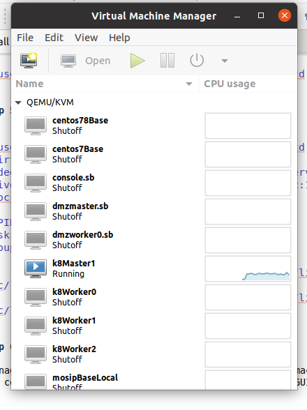

# INSTALL KVM ON UBUNTU MACHINE

## Prerequisites

Make sure that your system has the hardware virtualization extensions: For Intel-based hosts, verify the CPU virtualization extension [vmx] are available using following command.

* To check whether the Ubuntu system supports virtualization, run the following command.

```
rahul@Ubuntu:~$ egrep -c '(vmx|svm)' /proc/cpuinfo
16
```
An outcome greater than 0 implies that virtualization is supported. 
From the output above, we have confirmed that our server is good to go.

* To check if your system supports KVM virtualization execute the command:

```
rahul@Ubuntu:~$ sudo kvm-ok
[sudo] password for user1: 
INFO: /dev/kvm exists
KVM acceleration can be used
```

If the “kvm-ok” utility is not present on your server, install it by running the apt command:

```
rahul@Ubuntu:~$ sudo apt install cpu-checker
```
Now execute the “kvm-ok” command to probe your system.

```
rahul@Ubuntu:~$ sudo kvm-ok
[sudo] password for user1: 
INFO: /dev/kvm exists
KVM acceleration can be used
```

## Step-1: Install KVM 

```
rahul@Ubuntu:~$ sudo apt install -y qemu qemu-kvm libvirt-daemon libvirt-clients bridge-utils virt-manager -y

rahul@Ubuntu:~$ sudo apt -y install virt-top libguestfs-tools libosinfo-bin  qemu-system virt-manager -y
```

## Step-2: Check libivirt is running 

```
rahul@Ubuntu:~$ sudo systemctl status libvirtd
● libvirtd.service - Virtualization daemon
     Loaded: loaded (/lib/systemd/system/libvirtd.service; enabled; vendor preset: enabled)
     Active: active (running) since Fri 2021-02-12 19:03:13 IST; 3h 38min ago
TriggeredBy: ● libvirtd-admin.socket
             ● libvirtd.socket
             ● libvirtd-ro.socket
       Docs: man:libvirtd(8)
             https://libvirt.org
   Main PID: 821 (libvirtd)
      Tasks: 20 (limit: 32768)
     Memory: 55.8M
     CGroup: /system.slice/libvirtd.service
             ├─ 821 /usr/sbin/libvirtd
             ├─1250 /usr/sbin/dnsmasq --conf-file=/var/lib/libvirt/dnsmasq/default.conf --leasefile-ro --dhcp-script=/usr/lib/libvirt/libvirt>
             └─1251 /usr/sbin/dnsmasq --conf-file=/var/lib/libvirt/dnsmasq/default.conf --leasefile-ro --dhcp-script=/usr/lib/libvirt/libvirt>
```

## Step-3: You can enable libvirt to start on boot by running:

```
rahul@Ubuntu:~$ sudo systemctl enable --now libvirtd
```

## Step-4: Check if KVM modules are loaded. For AMD you will see kvm_intel

```
rahul@Ubuntu:~$ lsmod | grep kvm
kvm_intel             282624  0
kvm                   663552  1 kvm_intel
```
### Step 5: check kvm installed

```
[mosipuser@k8Master1 ~]$ virsh list --all

 Id    Name                           State
----------------------------------------------------

```
Right now there are no machines are there, therefore its empty.

### Step 6: virt-manager

virt-manager is a GUI based tool, Which helps to manage kvm machines 
we also could launch/start it from terminal as well as from GUI.

```
[mosipuser@k8Master1 ~]$ virt-manager
```
                 
 
 
 
# References

* [Techmint.com](https://www.tecmint.com/install-kvm-on-ubuntu/)
* [github.com](https://github.com/adrowit/ekyc/blob/master/doc/infra/kvm.md)